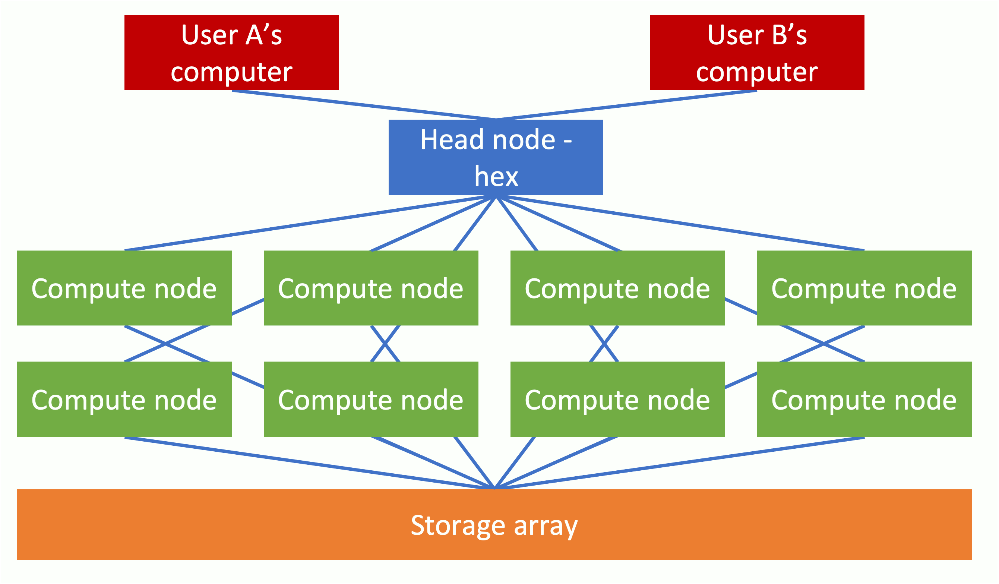

# Computational processing of high-throughput DNA sequencing experiments
This page gives on overview of how to process data generated by Next Generation Sequencing (NGS) experiments, such RNA-seq, ChIP-seq and ATAC-seq.  The analysis involves running Nextflow bioinformatics pipelines on the LMB compute cluster.

You may not need to read all of this page as much of the content may already be familiar to you.  Broadly, the first section gives a [general overview of NGS data](#what-is-ngs-data), which is followed by a second section providing a [brief description of compute clusters](#what-is-a-compute-cluster).  The next section gives practical information on how to [get set up on the LMB cluster](#using-the-cluster).  Finally, there is information on [how to run bioinformatics pipelines on the LMB cluster](#running-nextflow).

## Introduction
For the past decade Next Generation Sequencing has been used ever more frequently in molecular biology studies, finding uses in new experimental techniques and applications.  Processing and NGS datasets is far from trivial however, for it requires substantial computational resources in terms of data storage, RAM (working memory) and processing power.  

Here at the LMB we have a powerful compute cluster available to researchers which can run NGS computational pipelines (note: a pipeline is simply a sequence of linked computational operations).  This guide provides an overview of how to access the **compute cluster** and run these pipelines quickly and easily.

### What is NGS data?
Next-generation sequencing is a massively parallel sequencing technology that offers ultra-high throughput.  The technology can be used for a wide range of applications, such as determining the genomic sequence of an organism, the expression levels of all the genes in a tissue or even to identify epigenetic modifications or genomic conformational changes.

The most commonly used NGS technology is the Illumina platform which generates millions to billions of short reads (typically 50 - 300bp in length) per run.  Should longer reads be required, then researchers can opt for PacBio or Oxford Nanopore platforms which generate much longer, but far fewer reads.  The pipelines currently described here are aimed at processing data generated in typical RNA-seq, ChIP-seq or ATAC-seq experiments, which all use the Illumina technology.

Click on the video below to learn more about the Illumina NGS platform.

The standard data output files from these sequencers is known as [FASTQ](https://en.wikipedia.org/wiki/FASTQ_format).  Such FASTQ files are essentially text files which record the sequence of each DNA read, along with an associated quality score which provide an estimate of the reliability of each base call. These files (usually in conjunction with genome reference and relevant metadata files) are processed by NGS bioinformatics pipelines .

### What is a compute cluster?
You will need access to the LMB compute cluster to start processing NGS datasets yourself.  But what exactly is a compute cluster?

Simply put, a compute cluster (also known as a computer cluster) is a set of computers that work together so that they can be regarded as a single entity.  These inter-connected computers (known as nodes) run software to coordinate the running of programs across the system.  This allows the complex processing of data simultaneously across multiple nodes to speed up running times.

Access to a cluster is via the head node (in practice, some clusters may actually have more than one head node).  The user can then pass commands to the head node, but the intensive computational tasks will not be carried out here, but rather they will be farmed out to the compute nodes.

---

## Using the Cluster

### Getting a cluster account
1. The first thing you need to do is get an account on the compute cluster via an [online form](http://nis1.lmb.internal/cgi-bin/newaccount.cgi).

2. Once you have the account you will also need to email a member of [Scientific Computing](https://www.mrc-lmb.cam.ac.uk/scicomp/index.php?id=about) and ask that you are added to the cluster 'singularity' group.  (This is necessary for running the pre-installed NGS pipelines.)

### Logging in to the cluster 
The descriptions below describe how to access the compute cluster when working physically on-site, at the LMB.  **For remote access, you will first need to connect to the [ATG server.](https://www.mrc-lmb.cam.ac.uk/scicomp/index.php?id=ssh-x2go)** 

Generally, users will be using PCs running Windows or Macs running iOS.  These different setups require different methods to access the cluster (we assume users running Linux do not require a bespoke description of how to access the cluster).

#### Accessing from an LMB-registered Mac
1. Open the 'terminal' window.  Do this by double-clicking the terminal icon (a black square with the >_ symbol in the top left corner).  Alternatively, press cmd + space simultaneously and then type 'terminal' in the Spotlight Search bar.

2.  The terminal window should now have opened.  Here you may type in commands for your Mac to execute.  To tell your Mac to connect to the cluster, enter the following command:

        ssh -Y hex

    Then enter your cluster password (which should have been sent to you after you registered for cluster access).   When you successfully login, a message will be displayed in the terminal window - usually informing you when you last logged in.

### Getting to grips with Linux
Unlike Macs (which run iOS) or PCs (which run Windows), our compute cluster runs a [Linux operating system](https://scientificlinux.org/).  This Linux operating system may seem unfamiliar to first-time users, since it does not receive input from the user who moves a mouse pointer to click icons on the screen.  Instead, the user types instructions into what is known as the 'command line'.

On your screen the command line will look similar to the text below:

    [username@hex ~]$
    
Try it yourself - type the following command, which will report back today's date (remember to press enter after typing the command):
        
    date

So, this command line may at first seem much less user-friendly than the more familiar iOS or Windows operating systems.  But actually the command line is very versatile, allowing the user to perform complex tasks with greater ease and speed than can be achieved by dragging and dropping icons with a mouse etc.  It takes a bit of practice to become familiar with Linux but it should save you plenty of time later on.  

While there are many Linux commands, users will tend to mainly use the commands listed below.

| **Command** | **Function**                                 |
| ----------- | -------------------------------------------- |
| cat         | print the contents of a file                 |
| cd          | change directory                             |
| cp          | copy                                         |
| ls          | list contents of a directory                 |
| mkdir       | create a directory                           |
| mv          | move / rename files or folders               |
| nano        | edit the contents of a file                  |
| pwd         | print current working directory location     |
| rm          | remove file                                  |
| rmdir       | remove a directory                           |

We shall not give a more detailed overview of Linux here, but we have put together a short video describing how to use Linux on the Cluster.

In addition, there are also a series of [very short tutorials](http://info.ee.surrey.ac.uk/Teaching/Unix/) produced by the University of Surrey.  Have a quick look at the first four tutorials and you should have a good idea of the most useful Linux commands.

And finally, here is a link to a useful [Linux Cheat Sheet](http://sites.tufts.edu/cbi/files/2013/01/linux_cheat_sheet.pdf)

### First-time setup
Once you have logged-in, there are a couple of commands you should run once to setup your system to be able to run Nextflow.

1.  We recommend using the 'bash' shell by default, instead of 'tcsh'.  Don't worry about this terminology if you haven't heard it before, simply put bash and tcsh are slightly different dialects of the same language.   When you enter commands into the terminal window you have just opened (also know as the shell), using bash or tcsh will sometimes result in different operations.  Firstly, just check whether you are using bash or tcsh.  Enter in the command line:

        echo $SHELL 

    If the output reports bash, then you do not need to change the shell.  However, if tcsh is reported instead, then follow Step 2 below.

2.  To set the bash shell permanently enter:

        cp ~admin/{.bashrc,.profile} $HOME
        ypchsh

    Then, follow the on-screen prompts and choose bash as your shell.

3. Run the command:
   
       curl -s https://raw.githubusercontent.com/StevenWingett/lmb-nextflow/main/nextflow_setup_cluster.sh | bash

    This command downloads and runs a configuration script. This will add Nextflow to your path (this simply means that when you type 'nextflow' in the command-line, your system will run the Nextflow software.  The script also adds the latest version of Java to your path (by default the cluster may be using an older version of Java that is not compatible with Nextflow).  The script also updates the pip3 installer and installs the Python3 module nf-core.

    (If you are a more experienced user and don't want to run the script, simply download it and use it as a guide to setup Nextflow in your cluster environment.)

 
4.  Logout of the cluster 

        exit

5. Log back in again to the cluster, as you did earlier (i.e. ssh -Y hex).  

6. To test your changes, enter the following:

        echo $SHELL

    This should report bash as the shell and not tcsh.

7. Nextflow should now be up and running for you on the cluster.  To check, enter:
        
        nextflow

    The Nextflow help message should now be printed to the screen

    Now try:

        nextflow run -dsl1 hello

    A welcome message should be printed to the screen

Sorry that was a little bit complicated, but you only have to do this once.

### Cluster Commands
So, the compute cluster uses Linux as its operating system, but in addition to this a cluster needs special software to enable all the compute nodes and head node(s) to communicate with one another and the data storage arrays.  Our cluster performs this task with software called [Slurm](https://slurm.schedmd.com/documentation.html).

The basic concept is that a user logs into the head node (use hex) and then uses Slurm to submit a job (computational task) to one or more compute nodes.  Dividing work between multiple cores and nodes is a way to speed up a job (parallelisation).

Fortunately, to use Nextflow you don't need to learn about Slurm in any real detail, for Nextflow acts as an interface between you and Slurm.  There are a small number of Slurm commands that are useful however, when trying to keep track of your running jobs.

To list the jobs running on the cluster (for all users):

    squeue

To list only your jobs running on the cluster:

    squeue -u $USER

(You will notice that your jobs will be listed once you set off Nextflow pipelines.)
 
### Copying data from your machine to the cluster (and vice versa)
So you've got data on your personal computer that you would like to analyse on the cluster.  How do you copy the data across?  We recommend using the free software tool [FileZilla.](https://filezilla-project.org/)  

Simply download the version of the software relevant to your operating system.  Open the software and login to the hex server using an sftp connection, and your cluster username and password.  Use Port 22.  Watch the video below for more details on how to do this.

---

## Running Nextflow
[Nextflow](https://www.nextflow.io/), like other software, is run using the command line.  Since Nextflow is a versatile and complex tool, there are many Nextflow commands and options that can be run.

It is worth pointing out that Nextflow is essentially a language to enable programmers to write bioinformatics pipelines.  Consequently, the Nextflow webpages may look heavy on the technical jargon, but the vast majority of this knowledge is not required for actually running a pipeline.

The Nextflow pipelines we run at the LMB have been written as part of a collaboration between teams of bioinformaticians across the globe.  These Nextflow pipeline constitute what is know as [nf-core](https://nf-co.re/).

Not all the pipelines listed at nf-core are currently available on the LMB cluster, although we are willing to add more pipelines, should there be demand from researchers.  Also, we may write and make available bespoke pipelines should the necessity arise.

## Help with Nextflow commands with GUIde-Piper
So, every pipeline has its specific set of instructions to get the pipeline running.  For many users new to bioinformatics and the command line, this can seem a little overwhelming - even with the guidance available here and on the nf-core website.

To assist users in running pipelines we have put together [GUIde Piper](http://nextflow.lmb.internal/), which is available on the LMB intranet.  At present all the user needs to do when going to GUIde Piper is to select the desired pipeline (e.g. RNA-seq, CHip-seq), select the data and metadata file locations and the reference genome to map against.  GUIde Piper will then produce a command that the user can copy and paste into the Cluster command line to start Nextflow running.

---

## Nextflow Pipelines
The following sections discuss in more detail the pipelines currently available on the compute cluster, what they are for and how to run them.  Obviously using [GUIde Piper](http://nextflow.lmb.internal/) is the simplest way to create the command to run a pipeline, but you may wish to modify the GUIde Piper command in some way.  The information given below is a good starting point to get further details for each pipeline and tailor it to your requirements.

### Downloading data from public repositories

**Pipeline name: fetchngs**

[Full Usage Docs](https://nf-co.re/fetchngs/1.5/usage)

#### Example walkthrough

Create a file listing on a separate line all the ids to process.

**Example Nextflow command (use GUIde-Piper for latest recommended command):**

    nextflow run nf-core/fetchngs -r 1.5 --input to_download.txt -config /public/singularity/containers/nextflow/lmb-nextflow/lmb.config -queue-size 4 -bg

#### Output
[Click here for output overview](https://nf-co.re/fetchngs/1.5/output)

**And remember, you can always use [GUIde Piper](http://nextflow.lmb.internal/) to help you creating your Nextflow command!**

### Processing RNA-seq data

**Pipeline name: rnaseq**

[Full Usage Docs](https://nf-co.re/rnaseq/3.6/usage)

#### Example walkthrough

**Create sample sheet example:**

    wget -L https://raw.githubusercontent.com/nf-core/rnaseq/master/bin/fastq_dir_to_samplesheet.py
    
    python3 fastq_dir_to_samplesheet.py <FASTQ_DIR> samplesheet.csv --strandedness <STRANDEDNESS> --read1_extension <READ 1 EXTENSION> --read2_extension <LEAVE BLANK FOR SINGLE END>

Strandedness options: 'unstranded', 'forward', 'reverse'

**Example Nextflow command (use GUIde-Piper for latest recommended command):**

    nextflow run nf-core/rnaseq -r 3.5 --input samplesheet.csv --genome GRCh38_v102 -config /public/singularity/containers/nextflow/lmb-nextflow/lmb.config -bg

#### Output
[Click here for output overview](https://nf-co.re/rnaseq/3.6/output)
**And remember, you can always use [GUIde Piper](http://nextflow.lmb.internal/) to help you creating your Nextflow command!**

### Processing ChIP-seq data 

**Pipeline name: chipseq**

[Full Usage Docs](https://nf-co.re/chipseq/1.2.2/usage)

#### Example walkthrough   
Make design file.  It has to be a comma-separated file with 6 columns, and a header row (column headers: group, replicate, fastq_1, fastq_2, antibody, control).  

Input FASTQ files need the extension ".fastq.gz" or ".fq.gz" 

[Click here for more details on making the design file](https://nf-co.re/chipseq/1.2.2/usage#multiple-replicates)

**Example Nextflow command (use GUIde-Piper for latest recommended command):**

    nextflow run nf-core/chipseq -r 1.2.2 --input design.csv --genome GRCm38_v100 -config /public/singularity/containers/nextflow/lmb-nextflow/lmb.config -bg

Note: the option --macs_gsize needs to be set for peak calling, annotation and differential analysis.

#### Output
[Click here for output overview](https://nf-co.re/chipseq/1.2.2/output)

**And remember, you can always use [GUIde Piper](http://nextflow.lmb.internal/) to help you creating your Nextflow command!**

#### Processing ATAC-seq data

**Pipeline name: atacseq**

[Full Usage Docs](https://nf-co.re/atacseq/1.2.1/usage)

#### Example walkthrough   
Make design file.  It has to be a comma-separated file with 4 columns, and a header row (column headers: group,replicate,fastq_1,fastq_2).  

Input FASTQ files need the extension ".fastq.gz" or ".fq.gz" 

[Click here for more details on making the design file](https://nf-co.re/atacseq/1.2.1/docs/usage#multiple-replicates)

**Example Nextflow command (use GUIde-Piper for latest recommended command):**

    nextflow run nf-core/atacseq -r 1.2.1 --input design.csv --genome GRCh38_v102 -config /public/singularity/containers/nextflow/lmb-nextflow/lmb.config -bg

#### Output
[Click here for output overview](https://nf-co.re/atacseq/1.2.1/output)

**And remember, you can always use [GUIde Piper](http://nextflow.lmb.internal/) to help you creating your Nextflow command!**

---

# Questions?

Any questions, just email Steven Wingett

